# Практическое занятие 1

**Ключевые слова**. Linux, стэк, локальные переменные, регистры общего назначения.

## Подготовка виртуальной среды

Для выполнения практических занятий необходимо предустановить операционную систему **Linux**.
Для этого достаточно воспользоваться любым средством виртуализации, например, [virtual box](https://www.virtualbox.org/wiki/Downloads).


Далее для примера рассматривается установка виртуальной машины `ubuntu desktop` посредством `Virtual Box`.

### Шаг 1. Создание виртуального диска фиксированного размера.


### Шаг 2. Подключение `cdrom` образа к виртуальной машине для установки операционной системы

В рамках практических занятий рекомендуется использовать [этот](http://releases.ubuntu.com/xenial/ubuntu-16.04.6-desktop-amd64.iso) дистрибутив по ссылке.

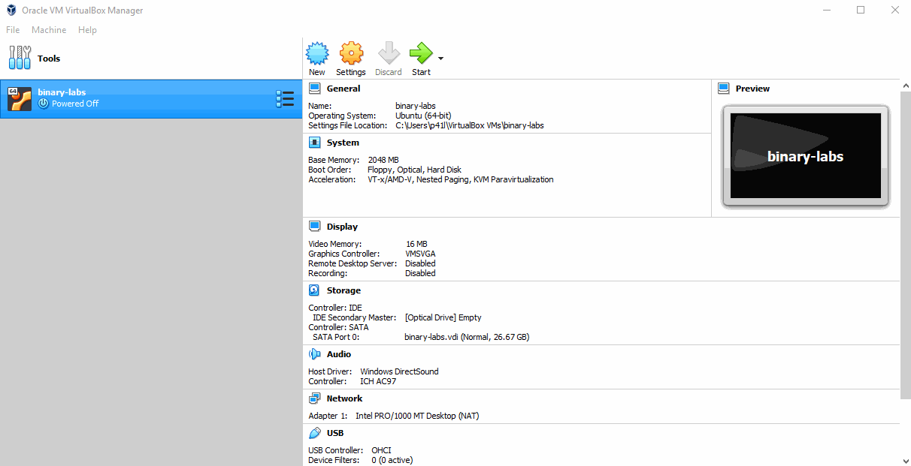

### Шаг 3. Установка операционной системы Ubuntu

Аутентификационные данные: 
- логин:    `student`
- пароль:   `cup`

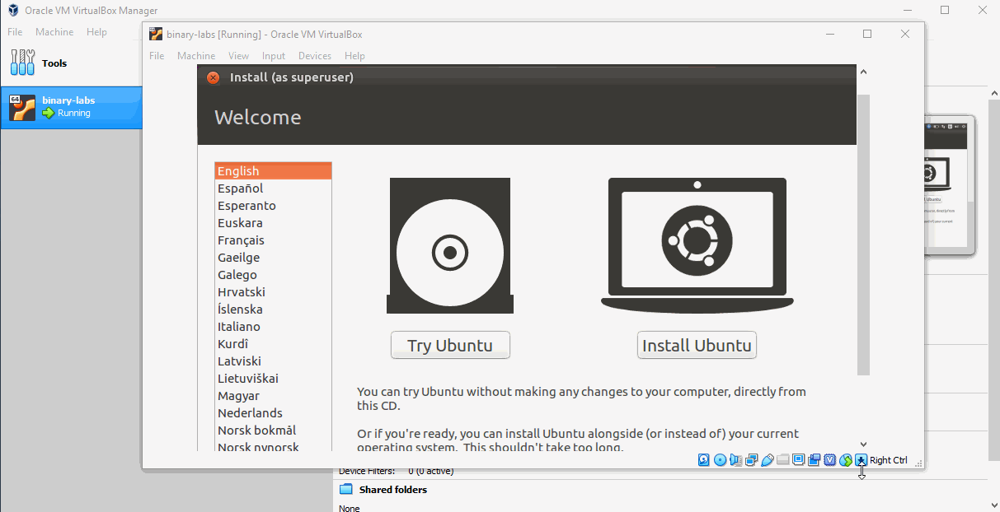

## Введенеи в администрирование Linux

Для выполнения заданий на практических занятиях вам необходимо освоить некоторые основные команды Linux.
Путем нажатия комбинации клавиш `Ctrl + Alt + T` вы можете вызвать окно терминала Linux.
Данный терминал предназначен для быстрого ввода команд, например, команда `ls` выведет файлы и папки из текущей директории,
а команда `echo` - сообщение на экран. 

<center></center>

При каждой новой установке операционной системы Linux рекомендуется обновить предустановленное программное обеспечение
следующей командой.

```bash
sudo apt-get update -y
sudo apt-get upgrade -y
```

<center>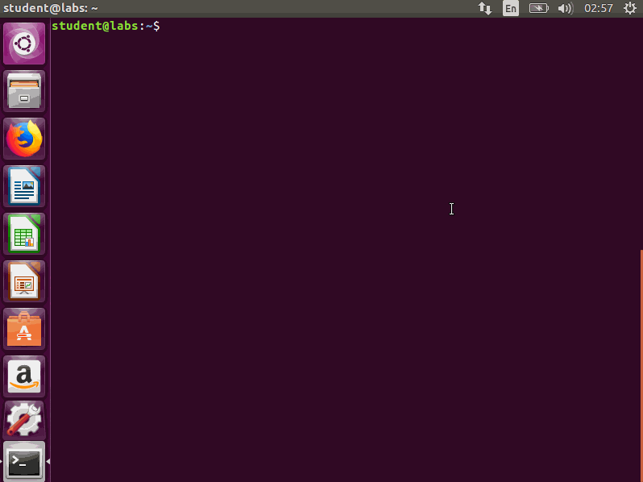</center>

Графическая оболочка представленной сборки Linux `Ubuntu` требует большого количества графических и вычислительных ресурсов,
что усложняет выполнение практических занятий. Отсюда рекомендуется удаленной управление операционной системой через `SSH`.
Для подключения к ОС через `SSH` необходимо установить сервер `openssh-server` на виртуальной машине.
Для этого вам необходимо выполнить следующие команды.

```bash
sudo apt install openssh-server -y
sudo sysmtectl enable ssh
sudo systemctl start ssh
```

<center></center>

Теперь у вас есть возможность подключаться к виртуальной машине через `SSH` с вашей рабочей операционной системы.
По умолчанию это можно сделать из любого доступного терминала: `powershell`, `terminal`,..
Стандартная установка виртуальной машины создает виртуальный адаптер, который определяет внутреннюю сеть виртуальной машины.
Для подключения к виртульной машине через `SSH` можно использовать два варианта:
1. Создать новый виртуальный адаптер
2. Сделать мост между сетевым адаптером основной операционной системой и виртуальными сетевым адаптером виртуальной машины

Далее рассматривается второй случай, первый случай останется вам на самостоятельное изучение.

<center>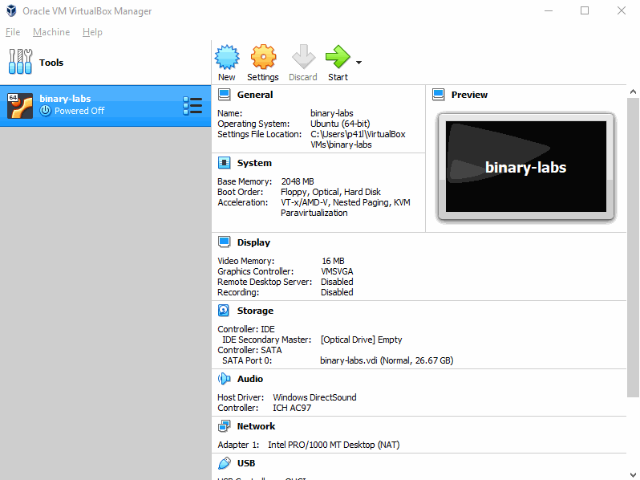</center>

Поздравляю! Теперь вы готовы подключиться к виртуальной машине по `SSH`. Для этого вам сначала необходимо определить `ip` адрес
виртуального сетевого адаптера. Это можно сделать, используя команду `ifconfig`, после чего вы можете подключиться к терминалу
виртуальной машины по `SSH`.

<center>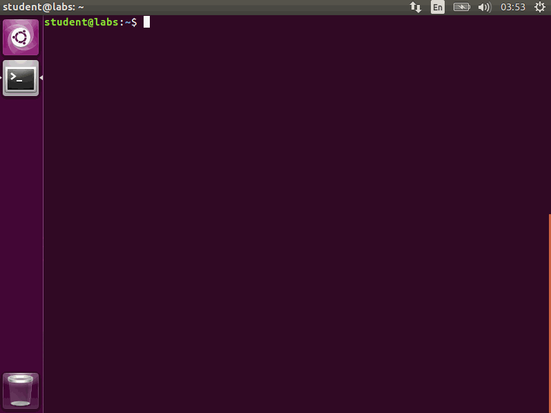</center>

Далее все команды будут выполняться посредством `SSH`.


## Введение в исполняемые файлы ELF

ELF - это формат исполняемых файлов в операционных системах семейства Linux.
По сути - это обычная программа, которая может быть выполнена в рамках операционной системы.
Рассмотрим следующую элементарную программу, написанную на языке программирования C.

```c
#include <stdio.h>

void show_msg(char * msg){
    puts(msg);
    return;
}

int main(int argc, char*argv[]){
    show_msg("Hello from lab!!!");
    return 0;
}
```

Данная программа осуществляет вывод сообщения `Hello from lab!!!` на экран терминала.
Для компиляции данной программы достаточно воспользоваться компилятором `gcc`, выполнив следующую команду.

```bash
gcc src.c -o bin
```
файл `src.c` содержит исходный код программы, `bin` - скомпилированный исполняемый файл.

<center>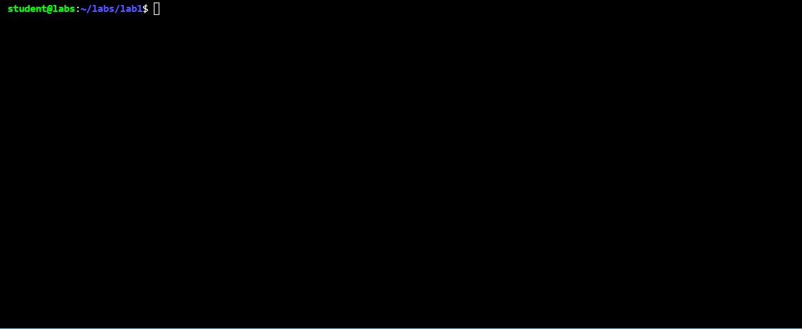</center>

Чтобы удостовериться в том, что файл `bin` действительно является исполняемый файлом `ELF`, можно 
воспользоваться командой `file`.

<center></center>

По выводу команды можно сделать вывод, что перед нами исполняемый файл `ELF` под архитектуру `x86_64`.

## Динамическая отладка исполняемых файлов ELF

Динамическая отладка - это один из ключевых инструментов для проведения анализа поведения исполняемого файла:

    - анализ трассы вызовов библиотечных/системных вызовов
    - анализ выделений памяти
    - анализ крэшей программы
    - анализ значений регистров
    - ...

По умолчанию, в рамках данного дистрибутива имеется `GNU` отладчик `GDB`. В рамках эксперимента вызовем 
скомпилированную программу ранее под отладкой. Для этого воспользуемся следующей командой.

```bash
gdb bin
```

<center></center>

Для выполнения лабораторных заданий необходимо установить необходимое программное обеспечение,
например расширение для отладчика `pwndbg`, которое содержит набор предустановленных макросов
для упрощения проведения отладки. Для этого воспользуемся следующими командами.

```bash
cat > ~/labs/scripts/install.sh << EOF
cd ~/labs/tools
sudo apt install git -y
sudo git clone https://github.com/pwndbg/pwndbg
cd pwndbg
chmod +x ./setup.sh && sudo ./setup.sh
cd ~
EOF
chmod +x ~/labs/scripts/install.sh
sudo ~/labs/scripts/install.sh
```

Обратите внимание, что в файловой системе заранее должны быть подготоволены папки `~/labs/scripts/` и `~/labs/tools`.
После обновления вновь вызовем команду `gdb bin`.

<center></center>

### Точки останова или breakpoints

Зачастую вместо кодов возврата программы и ее вывода на экрана интересно проанализировать состояние запускаемого
процесса в определенные моменты его выполнения, например, в момент старта программы.
В рамках эксперимента поставим точку останова (далее будем называть это `breakpoint`) в момент старта функции `main`, поскольку именно эта функция является точкой входа программы.
Для этого в отладчике перед запуском программы необходимо выполнить команду `break main` или `b main`. После запуска
программа остановится в момент вызова функции `main`.

<center></center>

### Адресное пространство процесса

В начальный момент выполнения программы интересно посмотреть адресное пространство процесса, по которому можно
определить адреса загрузки библиотек, загрузчик, область стека, динамическую область памяти (куча). Для этого воспользуемся командой `vmmap`.

<center>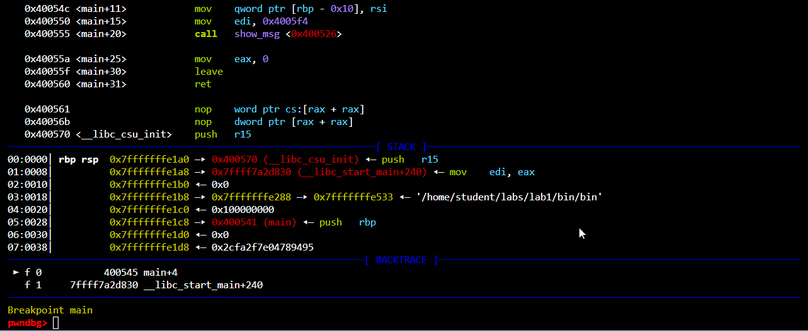</center>

Для отображения данных, расположенных по адресам, воспользуемся командой `x/32gx <address>`, которая отобразит 32 8-байтовых значения, начиная с указанного адреса.

<center>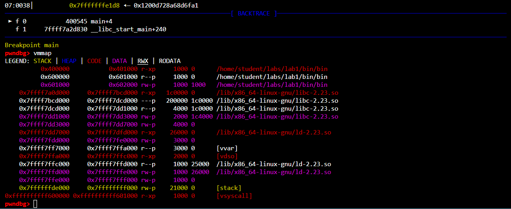</center>

Постфикс `x` - определяет шестнадцатиричный формат выводимых данных, `i` - отображает данные как инструкции процессора.

### Регистры `RBP` и `RSP`

Все локальные переменные программы располагаются в стековой области памяти. Для наглядного примера рассмотрим следующую элементарную программу.

```c
#include <stdio.h>

void show_msg(char * msg){
    puts(msg);
    return;
}

int main(int argc, char*argv[]){
    int a = 0x1337;
    show_msg("Hello from lab!!!");
    return 0;
}
```

Отличием данной программы от предыдущей является лишь наличие локальной переменной `a` в функции `main`.
Скомпилируем новую программу и рассмотрим, чем отличается генерируемый ассемблерный листинг от предыдущего.

<center>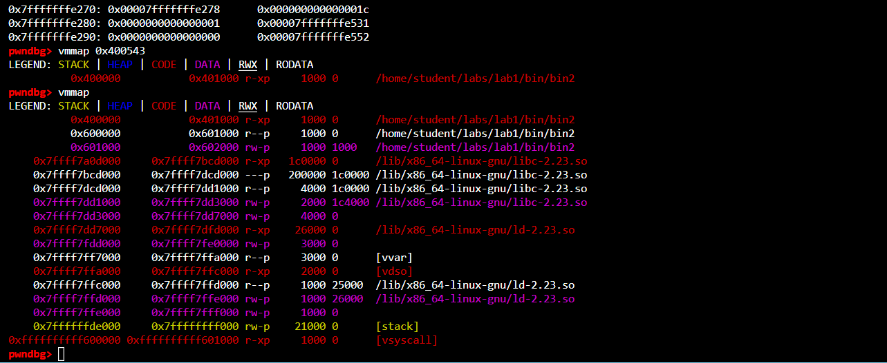</center>

Легко видеть, что появилась новая инструкция ` mov dword ptr [rbp - 4], 0x1337`. Данная инструкция осуществляет сохранение значения `0x1337` по адресу в стеке, который определяется значением `rbp - 4`. Для того, чтобы понять, какое значение содержится в момент данной инструкции, необходимо установить `breakpoint` по адресу данной инструкции и вывести значение `rbp - 4` путем вызова команды `p/x $rbp - 4`.

<center>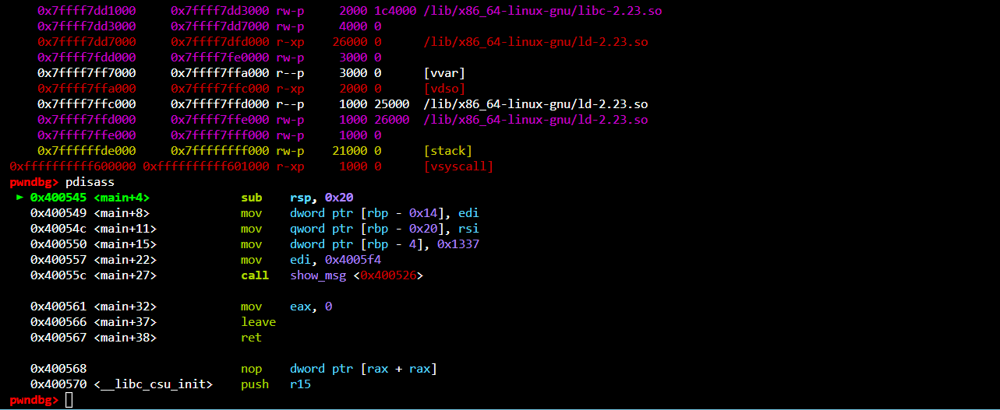</center>

Важно заметить, что память на стеке выделяется к меньшим адресам, что видно по инструкции `sub rsp, 0x20`, которая выделяет на стеке 32 байта (rsp = rsp - 0x20). Комбинация инструкций `push rbp; mov rbp, rsp` определяет пролог функции:
    
    1. Предыдущее значение регистра `rbp` кладется на стек
    2. Значение регистра `rbp` перезаписывается значением регистра `rsp`

Внимательный читатель обратит внимание, что все локальные переменные заполняются через адресацию относительно регистра `rbp`.

### Автоматизация работы с `GDB`

Безусловно ручная отладка - это самый надежный способ идентифицировать уязвимость или программну ошибку в исполняемом коде, но зачастую бывают задачи, которые требуют получить определенное значение в момент конкретной функции и продолжить исполнение. Для таких случаев достаточно удобно использовать `python API`, которе предоставляется модулем `GDB`. Далее представлен элементарный `GDB` скрипт, который устанавливает `breakpoint` по адресу функции `main`, выводит значение регистра `rbp` и продолжает выполнение программы.

```python
import gdb

gdb.execute('b main')
gdb.execute('run')
rbp = gdb.execute('p/x $rbp', to_string=True).strip()

print('rbp value --> %s' % rbp)
```

Использовать данный скрипт можно следующим образом.

<center>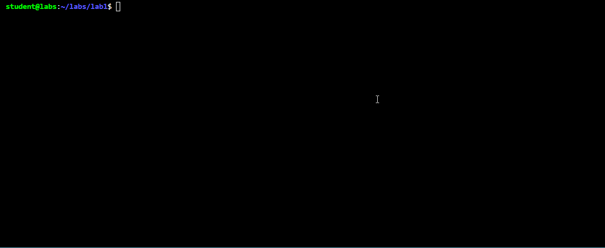</center>

## Задания

1. Подготовить виртуальную среду
2. Изучить основные команды `gdb`
3. Разработать микропрограмму на языке программирования `C` c 20 локальными переменными различного типа и продемонострировать вывод некоторых из них в консоли отладчика `GDB`
4. Идентифицировать все локальные переменные через `GDB` в исполняемом файле `tasks/task3`
5. Идентифицировать все локальные переменные через `GDB` в любой библиотечной функции 
6. (!) Реализовать `GDB` скрипт, который идентифицирует все локальные переменные в заданной функции
7. (!!) Реализовать `GDB` скрипт, который идентифицирует все локальные переменные в программе
8. (!!!) Разработать плагин для `GDB`, который выводит значения всех локальных переменных в данной функции