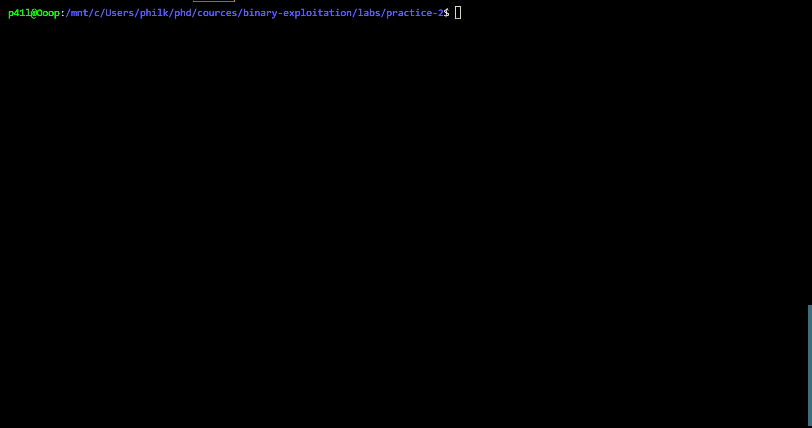
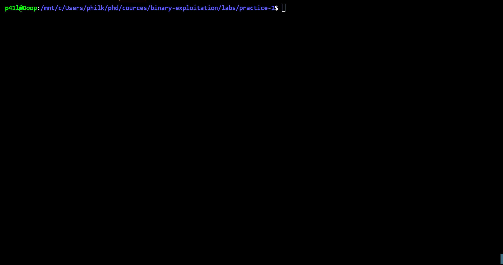
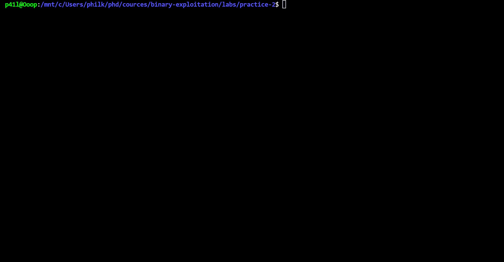

# Практическое занятие 2

**Ключевые слова**. Linux, утечка стековой памяти.

## Что находится на стеке

* С точки зрения бинарной эксплуатации стек обладает большим количеством данных, которые влияют на выбор способ эксплуатации той или иной уязвимости. Зачастую эти данные имеют большую значимость при условии наличия механизмов защиты, например, `ASLR`, которые подробнее будут рассмотрены на следующих практических занятиях.
Рассмотрим следующу элементарную программу.

```c
#include <stdio.h>

int main()
{
    char *msg = "hell from program !";
    puts(msg);
    // done
}
```

Поставим `breakpoint` на функции `main` и рассмотрим проинициализированные значения на стеке.



По выводу отладчика `GDB` легко заметить, что стековое адресное пространство содержит различные значения адресов. Чтобы понять, к какому модулю относится данный адрес, достаточно воспользоваться командой `vmmap`.

Важно отметить следующие важные адреса:
- произвольный адрес исполняемого файла (в данному случае файла `program-1`)
- произвольный адрес библиотеки `libc`
- значение канарейки (выставляется при включенном `ASLR`)
- адреса динамической области памяти (`heap`)

Данные значения могут существенно упростить бинарную эксплуатацию. Усовершенствуем данную программу до следующего вида.

```c
#include <sys/types.h>
#include <string.h>
#include <stdlib.h>
#include <unistd.h>
#include <errno.h>
#include <stdio.h>

unsigned int read_str(char *msg, unsigned int size) {
    char el;
    ssize_t rbytes;
    ssize_t nbytes = 0;
    while (nbytes < size){
        rbytes = read(0, &msg[nbytes], 1);
        if (rbytes == -1){
            if (errno == EAGAIN || errno == EINTR){
                continue;
            }
            return -1;
        }
        if (rbytes == 0){
            break;
        }
        if (msg[nbytes] == '\n') {msg[nbytes] = '\x00'; break;}  
        nbytes += rbytes;
    }
}

void update_name(char *name, unsigned int size)
{
    printf("new name: ");
    read_str(name, sizeof(name));
    printf("name is updated\n");
}

void quit(char * name)
{
    printf("Bye %s\n", name);
    exit(1);
}

int main()
{
    setvbuf(stdin, NULL, _IONBF, 0);
    setvbuf(stdout, NULL, _IONBF, 0);
    char name[0x20];
    char cmd[0x10];
    printf("Input your name --> ");
    read_str(name, sizeof(name));
    printf("Hi %s, nice to meet you!!!\n", name);
    while(1){
        printf("What do you want to do??\n");
        printf("--> ");
        read_str(cmd, sizeof(cmd));
        if (!(strcmp(cmd, "u"))){
            update_name(name, sizeof(name));
        } else if (!(strcmp(cmd, "q"))){
            quit(name);
        } else {
            printf("wrong command!!\n");
        }
    }
}
```

Логика данной программы достаточно простая: пользователь вводит свое имя, которое впоследствии выводится в консоль в составе привествия, может изменить свое имя и выйти из программы


Обратим внимание, что под имя выделяется буфер на стеке размером 32 байта. Попробуем занести в буфер имя длиною 32 байта.



Обратите внимание, что вместе со строкой в 32 байтa в консоли отображаются лишние символы. Чтобы разобраться, что это за символы, исследуем области стековой памяти, куда заносятся байты имени.



В ходе отладки легко установить, что в данной программе отсутствует `NULL` терминирование для строк с длиной равной размеру выделяемого буфера. Это объясняет такое поведение программы. Функция `printf` будет выводить строку имени до тех пор, пока не встретиться `NULL` байт. Также можно установить, что вместе с именем выводится значение адреса стека. Чтобы верифицировать это, достаточно также воспользоваться командой `vmmap`.

## Stack canary

Один из самых известных способов защиты программы от переполнения на стеке является механизм `stack canary protection`. Заключается он в том, что в специальном регионе памяти (а именно `fs:[0x28]`) располагается 8-ми байтовое значение, которое перед выполнением функции программы копируется в начало стека. В случае, когда данное значение поменяется, сработает исключение, которые вызовет экстренное завершение программы.

Рассмотрим следующую модификацию программы.

```c
#include <sys/types.h>
#include <string.h>
#include <stdlib.h>
#include <unistd.h>
#include <errno.h>
#include <stdio.h>

unsigned int read_str(char *msg, unsigned int size) {
    char el;
    ssize_t rbytes;
    ssize_t nbytes = 0;
    while (nbytes < size){
        rbytes = read(0, &msg[nbytes], 1);
        if (rbytes == -1){
            if (errno == EAGAIN || errno == EINTR){
                continue;
            }
            return -1;
        }
        if (rbytes == 0){
            break;
        }
        if (msg[nbytes] == '\n') {msg[nbytes] = '\x00'; break;}  
        nbytes += rbytes;
    }
}

void update_name(char *name, unsigned int size)
{
    printf("new name: ");
    read_str(name, sizeof(name));
    printf("name is updated\n");
}

void quit(char * name)
{
    printf("Bye %s\n", name);
    exit(1);
}

char *get_name(){
    char name[0x20];
    printf("Input your name --> ");
    gets(name);
}

int main()
{
    char surname[0x10];
    setvbuf(stdin, NULL, _IONBF, 0);
    setvbuf(stdout, NULL, _IONBF, 0);
    char *name;
    char cmd[0x10];
    name = get_name();
    printf("Hi %s, nice to meet you!!!\n", name);
    while(1){
        printf("What do you want to do??\n");
        printf("--> ");
        read_str(cmd, sizeof(cmd));
        if (!(strcmp(cmd, "u"))){
            name = get_name();
        } else if (!(strcmp(cmd, "q"))){
            quit(name);
        } else {
            printf("wrong command!!\n");
        }
    }
}
```

Логика программы сохранена, отличием является наличие дополнительной функции `get_name`, в которой применяется небезопасная функция `gets`. Данная функция заполняет буфер данными до тех пор, пока не встретит символ `\n`. Более подробно об этой функции можно узнать через `linux` мануал, для этого достаточно вбить в консоли команду `man gets`.

Попробуем переписать значение канарейки.


Как видно из вывода программы, перезапись канарейки была задетектирована.

## Задания

- `python`-скрипт, который позволит вывести адрес стека в шестнадцатиричном виде через уязвимость/уязвимости программы 2
- `python`-скрипт, который позволит вывести адрес `libc` в шестнадцатиричном виде через уязвимость/уязвимости программы 2
- `python`-скрипт, который позволит вывести базовый адрес `libc` (адрес загрузки `libc`) в шестнадцатиричном виде через уязвимость/уязвимости программы 2
- `python`-скрипт, который позволит вывести адрес стека в шестнадцатиричном виде через уязвимость/уязвимости программы 3
- `python`-скрипт, который позволит вывести адрес `libc` в шестнадцатиричном виде через уязвимость/уязвимости программы 3
- `python`-скрипт, который позволит вывести базовый адрес `libc` (адрес загрузки) в шестнадцатиричном виде через уязвимость/уязвимости программы 3
- Устранить уязвимости [программы 2](./src/program-2.c), скомпилировать измененную программу, продемонстрировать, что данная программа неуязвима
- Устранить уязвимости [программы 3](./src/program-3.c), скомпилировать измененную программу, продемонстрировать, что данная программа неуязвима
- открыть дверь в [программе 4](./src/program-4.c) :)
- ** Реализовать надстройку над функцией `printf` в рамках библиотеки `libc`, которая позволит детектировать утечку памяти
